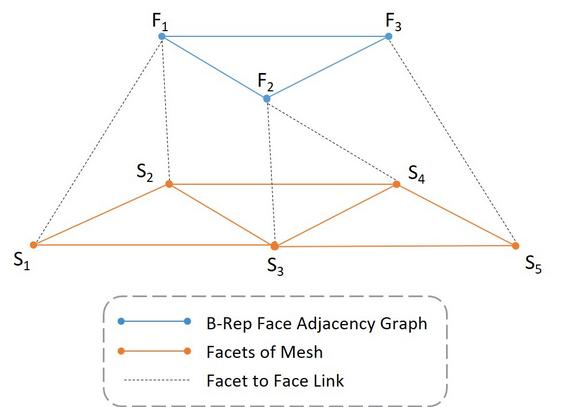

# Hierarchical-CADNet

This project provides a deep learning approach to learn machining features from CAD models. To achieve this, the geometry of the CAD models are described by discretising the surface of the CAD model into a mesh. This mesh can then be treated as a graph and operated on by a graph neural network. The overall topology of the CAD model can be described by the face adjacency matrix. A hierarchical graph structure can be constructed by between the B-Rep adjacency graph and the mesh. A STL mesh was chosen as the tessellation method due to its wide availability in CAD system and offers a concise representation. Each facet in the mesh denotes a vertex in a level of the hierarchical graph. Each of these vertices contain information of the facet’s planar equation, used to describe the surface. A second level of the hierarchical graph denotes the B-Rep adjacency graph. There exists persistent links between each B-Rep face vertex and their corresponding STL facet vertex. A B-Rep face vertex can have more than one STL facets adjacent to it. The goal of the approach is to be able to classify the machining feature of each B-Rep face vertex in the graph. 

