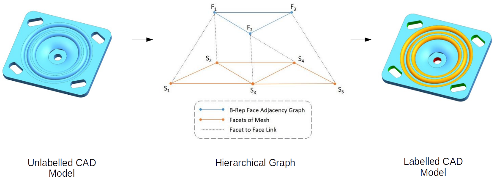

# Hierarchical-CADNet
This repo provides a code of the neural network described in the paper:
**Hierarchical CADNet: Learning from B-Reps for Machining Feature Recognition**.

It is a deep learning approach to learn machining features from CAD models. To achieve this, the geometry of the CAD models are described by discretising the surface of the CAD model into a mesh. This mesh can then be treated as a graph and operated on by a graph neural network. The overall topology of the CAD model can be described by the face adjacency matrix. A hierarchical graph structure can be constructed by between the B-Rep adjacency graph and the mesh. A STL mesh was chosen as the tessellation method due to its wide availability in CAD system and offers a concise representation. Each facet in the mesh denotes a vertex in a level of the hierarchical graph. Each of these vertices contain information of the facet’s planar equation, used to describe the surface. A second level of the hierarchical graph denotes the B-Rep adjacency graph. There exists persistent links between each B-Rep face vertex and their corresponding STL facet vertex. A B-Rep face vertex can have more than one STL facets adjacent to it. The goal of the approach is to be able to classify the machining feature of each B-Rep face vertex in the graph. 

## Requirements
- Python > 3.8.5
- Tensorflow > 2.2.0
- h5py > 1.10.6
- Numpy > 1.19.1
- Scikit-learn > 0.23.2

## Instructions
- Place dataset in */data* folder.
- To train Hierarchical CADNet (Edge) which uses edge convexity information run **train_edge.py**, set data type, dataloader file locations.
- To train Hierarchical CADNet (Adj) which uses only adjacency information run **train_adj.py**, set data type, dataloader file locations.
- To train Hierarchical CADNet (Single) which is a graph classification task run **train_single_feat.py**, set data type, dataloader file locations.

## Citation
Please cite this work if used in your research:

    @article{hierarchicalcadnet2021,
      Author = {Andrew R. Colligan, Trevor. T. Robinson, Declan C. Nolan, Yang Hua, Weijuan Cao},
      Journal = {Computer-Aided Design},
      Title = {Hierarchical CADNet: Learning from B-Reps for Machining Feature Recognition},
      Year = {2022}
      Volume = {147}
      URL = {https://www.sciencedirect.com/science/article/abs/pii/S0010448522000240}
    }

## Funding 
This project was funded through DfE funding.
